# DO1_LINUX: Базовая работа с Ubuntu Server. Автор: Булат qyburnpr

## Содержание:
1. [Установка ОС](#part-1-установка-ос)
2. [Создание пользователя](#part-2-создание-пользователя)
3. [Настройка сети ОС](#part-3-настройка-сети-ос)
4. [Обновление ОС](#part-4-обновление-ос)
5. [Использование команды  sudo](#part-5-использование-команды-sudo)
6. [Установка и настройка службы времени](#part-6-установка-и-настройка-службы-времени)
7. [Установка и использование текстовых редакторов](#part-7-установка-и-использование-текстовых-редакторов)
8. [Установка и базовая настройка сервиса SSHD](#part-8-установка-и-базовая-настройка-сервиса-sshd)
9. [Установка и использование утилит top, htop](#part-9-установка-и-использование-утилит-top-htop)
10. [Использование утилиты fdisk](#part-10-использование-утилиты-fdisk)
11. [Использование утилиты df](#part-11-использование-утилиты-df)
12. [Использование утилиты du](#part-12-использование-утилиты-du)
13. [Установка и использование утилиты ncdu](#part-13-установка-и-использование-утилиты-ncdu)
14. [Работа с системными журналами](#part-14-работа-с-системными-журналами)
15. [Использование планировщика заданий CRON](#part-15-использование-планировщика-заданий-cron)

## Part 1. Установка ОС
### 1.1 Установка
 > Настроил и создал виртуальную машину в программе VirtualBox, и установил на неё операционную систему Ubuntu Server 20.04.6 LTS (LongTermService), скачав подходящий для меня iso-образ с официального сайта Ubuntu. Поскольку эта ОС для серверов, у неё отсутствует графический интерфейс.
### 1.2 Запуск
> Первое сообщение, которое встречает нас после установки и запуска системы:
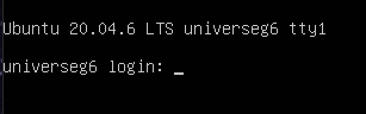
>
> Система просит ввести логин и пароль для входа. После ввода логина и пароля родительского пользователя, нас встречает вот такое приветствие:
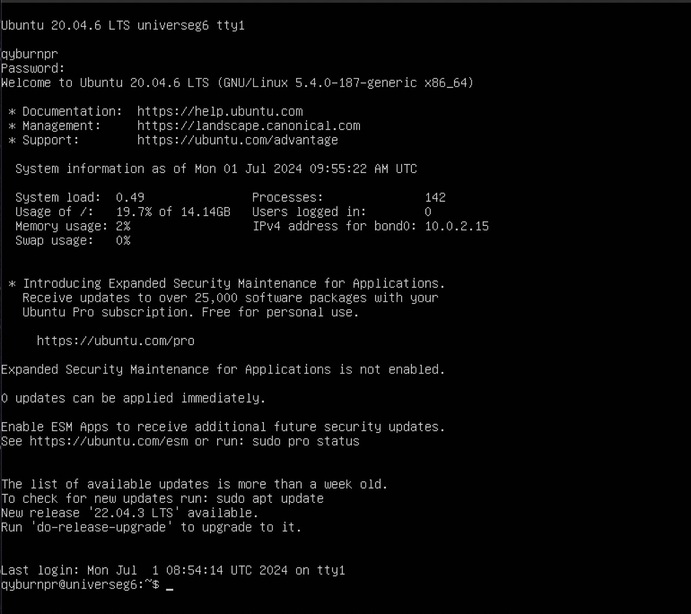
### 1.3 Узнаю версию системы
> Впринципе, выше уже видна версия операционной системы, но также её можно узнать в любой момент, прописав в терминале команду:
> - [X] `cat /etc/issue`
> 
> 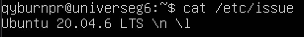
> - `cat` - выводит в терминал содержимое файлов
> - /etc - **e**ditable **t**ext **c**onfigurations - папка в линукс в которой хранятся настройки системы в виде конфигурационных файлов, которые можно редактировать.
> - /etc/issue - файл, в котором записано приветственное сообщение (login message), которое выводится на экран перед вводом логина и пароля , называется **issue** - потомучто это с англиского "выдача"/"вывод". Содержимое файла /etc/issue как раз и выводится на экран в самом начале при запуске системы, и на самом первом скрине это он и есть. Текст этого файла можно даже отредачить, на что намекает название папки, в которой он находится (**e**ditable **t**ext **c**onfigurations). И при запуске системы вас будет встречать любое сообщение, какое вы только захотите. Я попробовал это сделать и это сработало:
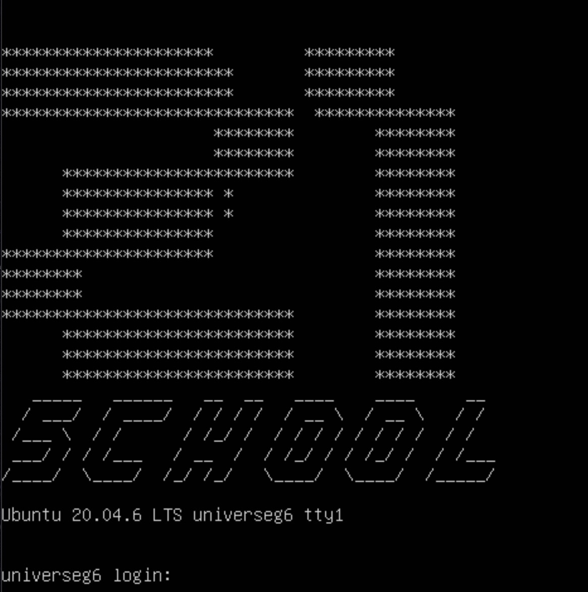

## Part 2. Создание пользователя
### 2.1. useradd
> Команда для создания нового пользователя в Линукс - `useradd` , попробую её ввести:
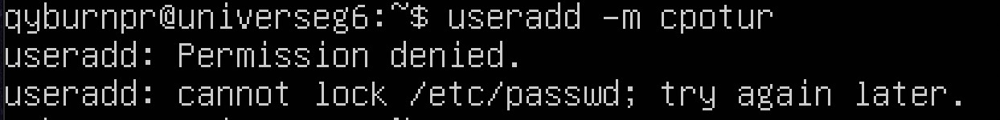
Система отказала мне с сообщением "доступ запрещён". Дело в том, что созданный мной при установке системы пользователь не обладает всеми правами в системе, и не имеет полный контроль над всеми файлами системы. В отличие от пользователя с именем **root** ! Это встроенный в систему пользователь, который создаётся автоматически в процессе установки системы. Его также называют суперпользователем.
Пользователь **root** имеет доступ ко всем файлам и может выполнять любые команды без ограничений. Это включает в себя редактирование системных конфигураций, установку и удаление программ, управление пользователями и многое другое. Короче, **root** может делать в системе ВСЁ. И если хочется выполнить какое-то действие, а на него нет прав, можно выполнить это действие от имени **root** пользователя, и действие выполнится. Для этого перед вводом команы нужно написать `sudo`. Подробнее о команде `sudo` рассказываю [**здесь**](#part-5-использование-команды-sudo).
Получается, что на некоторые команды у моего пользователя по умолчанию нет прав, но я могу вызвать эти команды, написав перед ними слово `sudo`. Отныне и далее, я так и буду делать, если для какого-то действия мне будут нужны root-права.
>
> Создаю нового пользователя: 
> - [X] `sudo useradd -m cpotyr`
> 
> 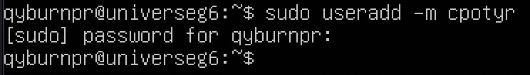
>
> > `-m`  -  создаёт для пользователя домашнюю директорию
> 
> Новый пользователь, созданный командой `useradd` сохраняется в текстовом файле **/etc/passwd**
> - Последняя строчка вывода команды `cat /etc/passwd`:

в системе есть новый пользователь

### 2.2. usermod
> Добавляю нового пользователя *cpotyr* в группу *adm*:
> 
> - [X] `sudo usermod -aG adm cpotyr`
> 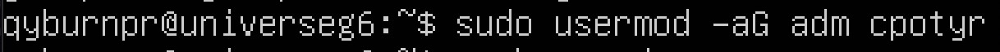
> > Опции:
> >
> > `-G`  - добавляет пользователя в указанную группу
> >
> > `-a`  - указывает что это дополнительная группа, а не замена основной группы (additional)
> > 
> > `-R`  - удаляет указанного пользователя из указанной группы
>
> - id нового пользователя:
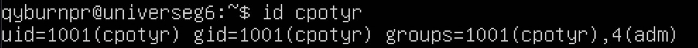

## Part 3. Настройка сети ОС
### 3.1 Задаю название машины вида user-1
> Изменяю имя компьютера (хоста) на "user-1"
> - [X] sudo hostname user-1
>  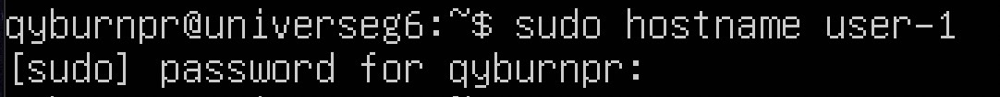
> После перезахода в систему изменения вступили в силу
> 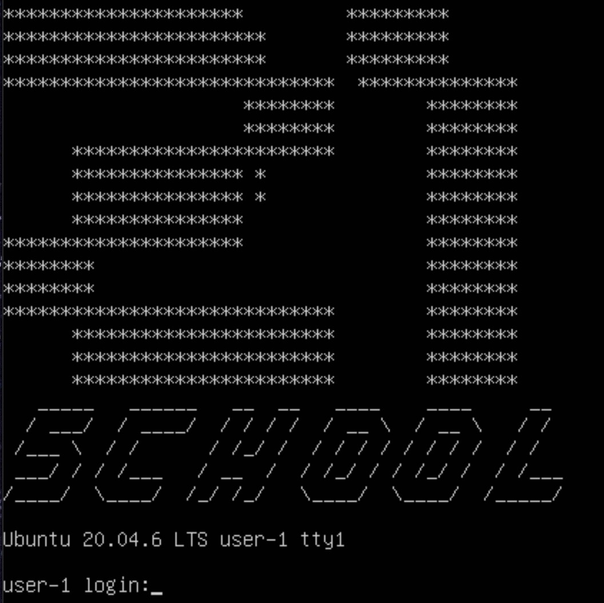
> 
> Имя сменилось с "universeg6" на "user-1" 👍
### 3.2 Устанавливаю временную зону, соответствующую моему текущему местоположению
> - [X] `sudo timedatectl set-timezone Europe/Moscow`
> 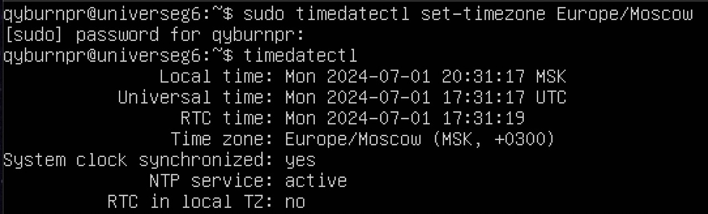
> "ctl" - сокращение от **c**on**t**ro**l**

> более простая команда, показывающая дату и время:
> - [X] `date`
> 
> 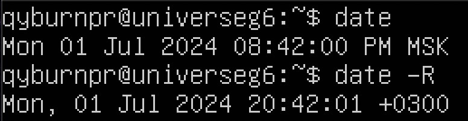
> > `-R` - показывает время в 24-часовом формате
> 
> Теперь время на момент вызова команды актуальное 👍
### 3.3 Вывожу названия сетевых интерфейсов с помощью консольной команды
> - [X] `ip a`
>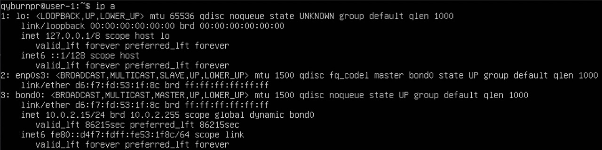
> В выводе команды видно что у меня есть 3 сетевых интерфейса: 
> 1. **lo** - 
> **loopback**-интерфейс
> 2. enp0s3 - Ethernet
> 3. bond0 - узел, который в отличие от первых двух интерфесов я добавил сам при установке системы. "Бонды" или узлы могут объединять несколько параллельных каналов передачи данных в сетях Ethernet. Узлы помогают сбалансировать нагрузку на выделенном сервере и повысить отказоустойчивость.
> 
> > **Что такое 
> loopback-интерфейс**:
> > это специальный сетевой интерфейс, который маршрутизирует сетевыe пакеты обратно к тому же устройству, которое их отправило. **Loopback** (в переводе с английского — «обратная петля»), потому что он возвращает сетевые пакеты обратно на тот же компьютер, откуда они были отправлены, как бы делая «петлю».
> > * **loopback**-интерфейс имеет по стандарту 
> > IP-адрес **127.0.0.1** 
> > и DNS-имя **localhost**
> > 
> > (IP - Internet Protocol, DNS - Domain Name System(система имён доменов(yandex, google, youtube - это имена доменов)))
> >
> > Можно представить аналогию с бумерангом: если послать запрост на ip-адрес
> > **127.0.0.1** 
> > или на DNS-имя **localhost** 
> > то запрос отправляется через интерфейс **loopback** на этот же самый компьютер, обрабатывается системой как сетевой запрос и если **loopback** работает исправно, запрос возвращается обратно к приложению на том же компьютере (бумеранг работает). **Loopback** используется для тестирования и отладки сетевых приложений и сервисов, а также для обеспечения доступа к локальной машине из сети. Его наличие и корректная настройка являются важными условиями для стабильной и безопасной работы системы.

### 3.4. Используя консольную команду, получаю ip адрес устройства, на котором работаю, от DHCP сервера.
> ### DHCP
> DHCP (**D**ynamic **H**ost **C**onfiguration **P**rotocol) - это протокол, который позволяет автоматически назначать IP-адреса устройствам в сети.
>
> Если говорить простыми словами, то DHCP - это как почтальон, который разносит письма (IP-адреса) по домам (компьютерам).
>
> Когда компьютер подключается к сети, он отправляет запрос на DHCP-сервер, который назначает ему IP-адрес. Этот адрес может быть временным или постоянным, в зависимости от настроек сервера.
>
> DHCP-сервер также может назначать другие параметры, такие как маска подсети, адрес шлюза и DNS-серверы. Это позволяет компьютерам в сети общаться друг с другом и получать доступ к интернету.
>
> Таким образом, DHCP упрощает процесс настройки сети, так как не нужно вручную назначать IP-адреса каждому устройству.

> Удалил старый, затем получил новый ip-адрес от DHCP-сервера
> - [x] `sudo dhclient -r` - удаляет ip-адрес хоста (r - remove)
> - [x] `hostname -i` - показывает ip-адрес хоста (i - ip)
> - [x] `sudo dhclient enp0s3` - выдаёт хосту новый ip-адрес через Ethernet-интерфейс
> 
> Также информация о ip-адресе и о другая конфигурационная информация записывается в файл **/var/log/syslog**
> 
>  Впринципе любая информация в системе Linux хранится в том или ином файле, поскольку Linux - UNIX-подобная система, а идеология системы UNIX - "Всё есть файл".
> 
> (**var** - "**var**iable(переменная)" - папка с частоменяющимися данными(переменная папка), например с **log**'ами, т.е. журналами системы)
>
> Поэтому ip можно также узнать комибнацией команд:
> - [x] `cat /var/log/syslog | grep -i dhcp`
> 
> скрин с этими командами:
> 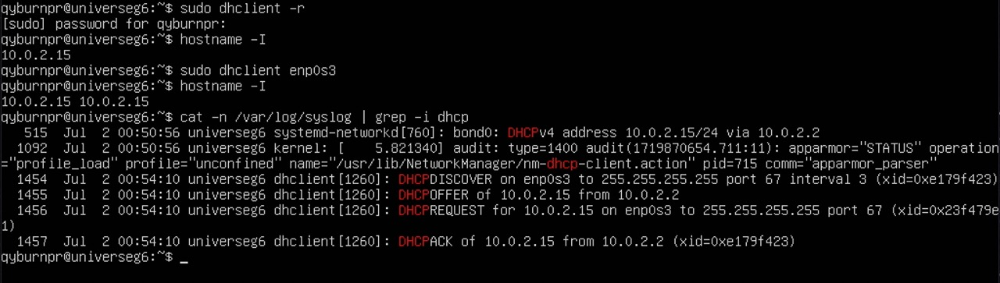
### 3.5. Определяю и вывожу на экран внешний ip-адрес шлюза (ip) и внутренний IP-адрес шлюза, он же ip-адрес по умолчанию (gw).
> - [x] `hostname -i` - узнал внутренний ip-адресс
> 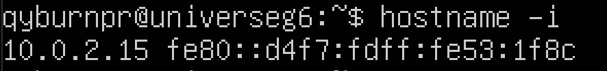
> 
> Команда вывела как IPv4 так и IPv6

> - [x] `curl ipinfo.io` - узнал внешний ip-адрес
> 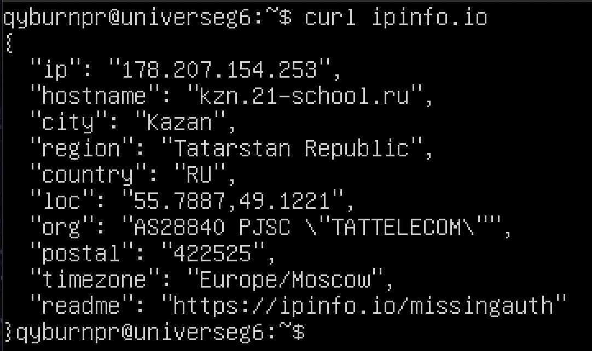
> Команда вывела внешний ip-адрес и кучу другой информации о подключении, такую как локацию, временную зону, провайдера и т.д.
> А по сути, `curl` - команда, которая может заходить на сайты и скачивать оттуда файлы и даже выводить их содержимое в терминал. Команда зашла на сайт ipinfo.io и вывела на экран информацию с этого сайта.

### 3.6. Задаю статичные (заданные вручную, а не полученные от DHCP сервера) настройки ip, gw, dns (используя публичный DNS серверы, например 1.1.1.1 или 8.8.8.8).
> - [x] `ls /etc/netplan`
> - [x] `sudo vim /etc/netplan/00-installer-config.yaml`
> 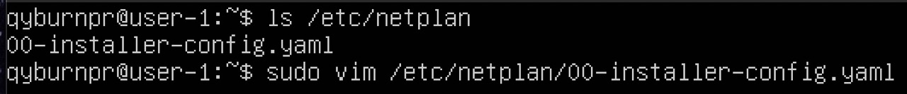
> Настройки ip, gw, dns хранятся в этом конфигурационном файле. Отредактирую его вручную через vim.
> 
> Было:
> 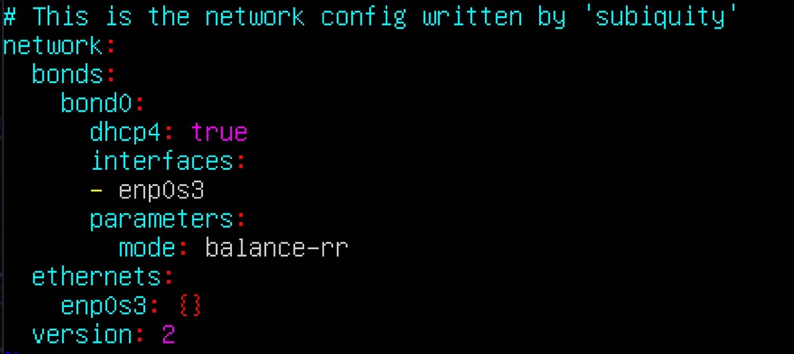
> Стало:
> 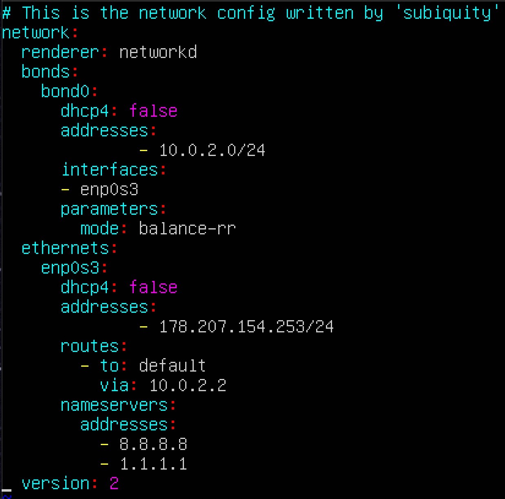
> Как видим, настройки ip заданы НЕ от DHCP-сервера

> Применяю изменения командой:
> - [x] `sudo netplan apply`
>
> И перезагружаю систему:
> - [x] `reboot`
> 
> 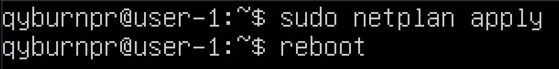
### 3.7. Перезагружаю виртуальную машину. Убеждаюсь, что статичные сетевые настройки (ip, gw, dns) соответствуют заданным в предыдущем пункте.
После перезагрузки:
> - [x] `ip addr show`
> 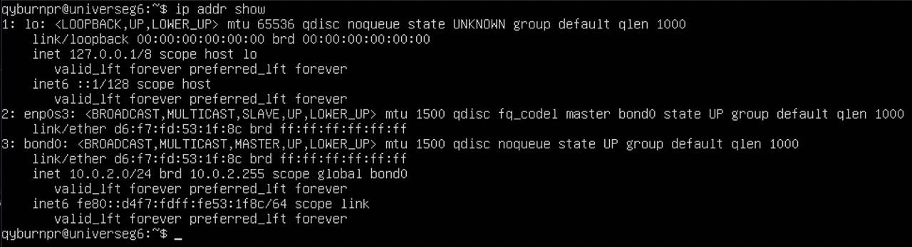

> Успешно пингую удаленные хосты 1.1.1.1, 8.8.8.8 и ya.ru:
> - [x] `ping 1.1.1.1`
> - [x] `ping 8.8.8.8`
> - [x] `ping ya.ru`
> 
> 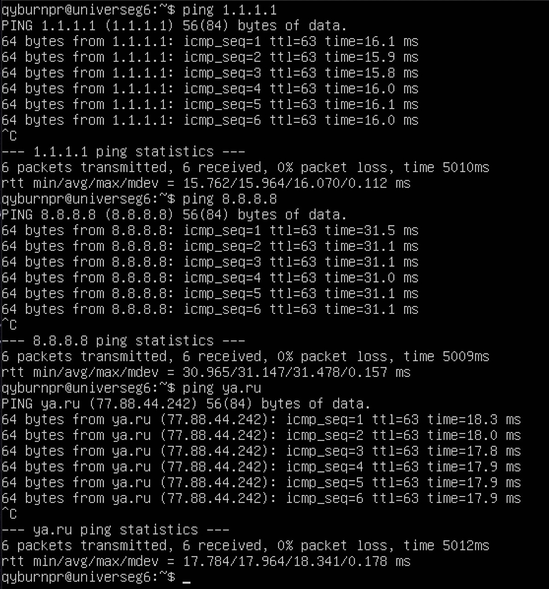
## Part 4. Обновление ОС
Для обновления системы буду использовать пакетный менеджер "apt". Также в Ubuntu есть пакетный менеджер "apt-get", но "apt" был введен как более удобная и современная альтернатива, с более понятным консольным выводом. Принципиальных различий между ними вроде бы нет, но, насколько я понял, "apt-get" подходит для более опытных пользователей и разработчиков и предпочтителен для скриптов и систем, где требуется стабильный и предсказуемый интерфейс командной строки.

> - [X] `sudo apt update` - обновляю список пакетов
> 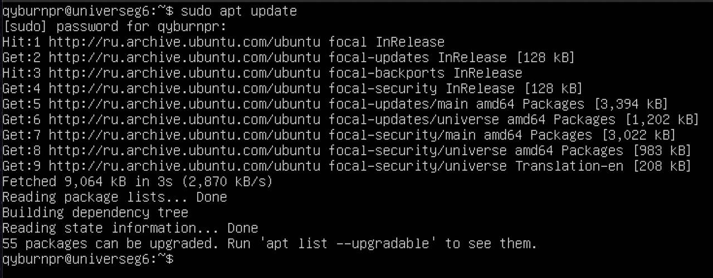

> - [X] `sudo apt upgrade` - обновляю сами пакеты
> 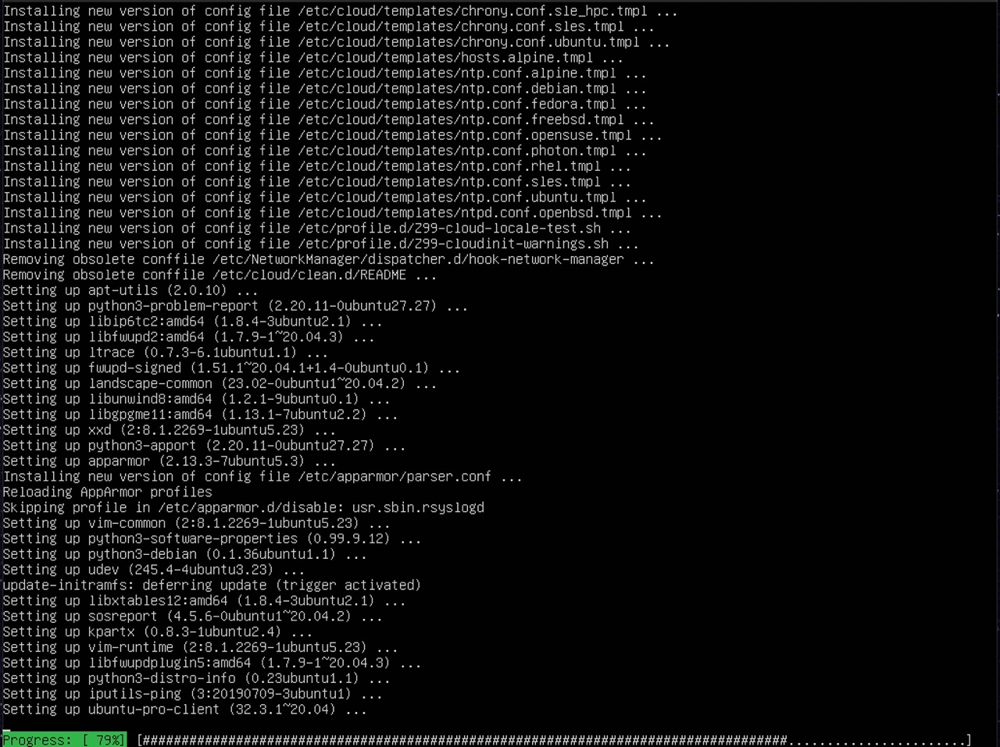
> Процесс обновления пошёл так быстро, что команда процесса сразу улетела наверх и я не успел её заскринить. Но всё обновилось.
> Если повторно ввести команду `sudo apt upgrade`, выйдет сообщение что обновления отсутствуют.
> 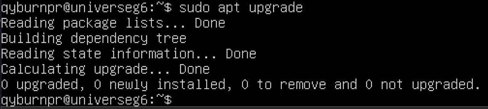
## Part 5. Использование команды sudo
`SUDO` (англ. **S**ubstitute **U**ser and **do**, дословно «cменить пользователя и сделать»)
Команда `sudo` предоставляет пользователям возможность выполнять команды от имени суперпользователя(😎) **root**, либо других пользователей. Правила, используемые sudo для принятия решения о предоставлении доступа, находятся в файле **/etc/sudoers** . 
Sudoers - пользователи, у которых есть право использовать команду sudo (судоеры). Если вам дали доступ к Линукс-серверу и добавили вас в список судоеров, впринципе это значит что вы можете делать на этом сервере всё то, что и **root**, но помните, что с большой силой приходит и большая ответственность ☝️.
Для редактирования файла **/etc/sudoers** можно использовать специальный редактор `visudo`, запускаемый из командной строки без параметров, в том числе без указания пути к файлу.
Но, разумеется, чтобы редактировать этот файл нужны **root**-права, иначе в этих ограничениях по правам не было бы никакого смысла. Получается, список судоеров могут изменять только судоеры. Например вот так:
- [X] `sudo visudo`

или так:
- [X] `sudo vim /etc/sudoers` 
- Вместо vim конечно же, может быть любой другой имеющийся текстовый редактор, но для этого файла рекомендуется visudo

Итак, давайте сначала убедимся, что у моего нового пользователя *cpotyr* нет root-прав, и нет прав на использование sudo, попробовав ввести от имени этого пользователя какую-нибудь команду, требующую root-прав. Для этого мне нужно либо выйти из системы (`exit` / `logout`) и перелогиниться на cpotyr, либо использовать команду `su` (**s**ubstitute **u**ser). Но ПЕРЕД этим, мне ещё сначала нужно дать пользователю *cpotyr* пароль, потомучто я этого не сделал в [Part 2.](#part-2-создание-пользователя)
> - [X] `sudo passwd cpotyr` - дал пользователю *cpotyr* пароль
> 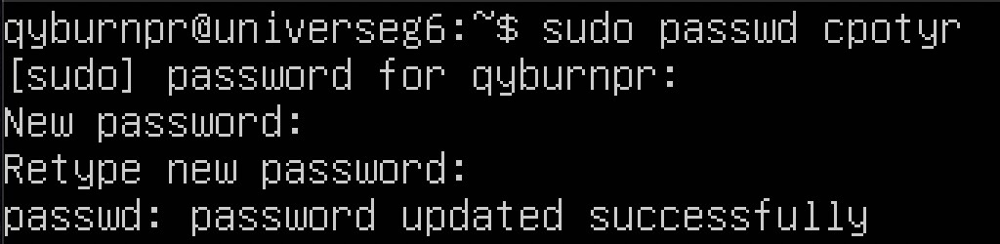

Теперь можно зайти на этого пользователя, и посмотреть может ли он например изменить имя хоста.
> - [X] `su cpotyr`
> - [X] `whoami` - показывает имя текущего пользователя
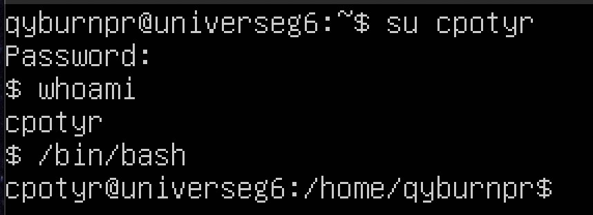

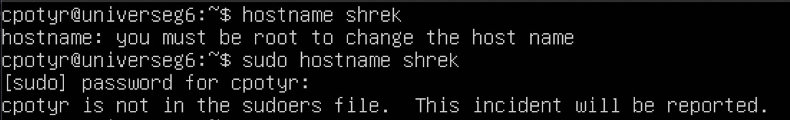
Система пишет что у *cpotyr* нет root-прав, и что *cpotyr* не может пользоваться sudo, поскольку его нет в списке судоеров. Логично, посколько я и не давал ему рут-прав и не вносил его в список судоеров. А ещё сказала что поябедничает куда-то об этом инциденте. Скорее всего она записала попытку ввода команды `sudo hostname shrek` от имени *cpotyr* в какой-то файл, который потом смогут открыть и почитать крутые судоеры.
Теперь я занесу пользователя *cpotyr* в список судоеров, перейдя на пользователя **root** и отредактировав файл **/etc/sudoers**.

Кстати, пользователю **root** тоже можно выдать пароль (естественно, это могут делать только судоеры), и __любой__ пользователь сможет переключиться на **root**-пользователя, если он будет знать пароль для **root**, командой `su root` или просто `su`. То есть для этого не обязательно быть судоером, достаточно знать пароль **root**.

А если пароля для **root** не знаешь, но являешься судоером, то можешь писать `sudo su root` / `sudo su` и система попросит пароль не для **root** а для того кто ввёл команду.
> - [x] `su qyburnpr`
> - [x] `sudo su root`
> - [x] `visudo`
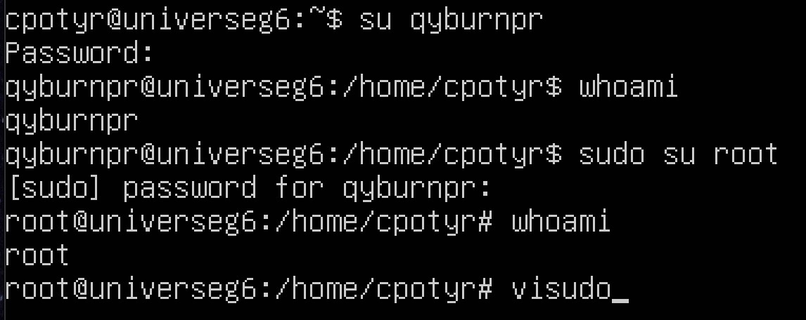

**/etc/sudoers**:

Было:
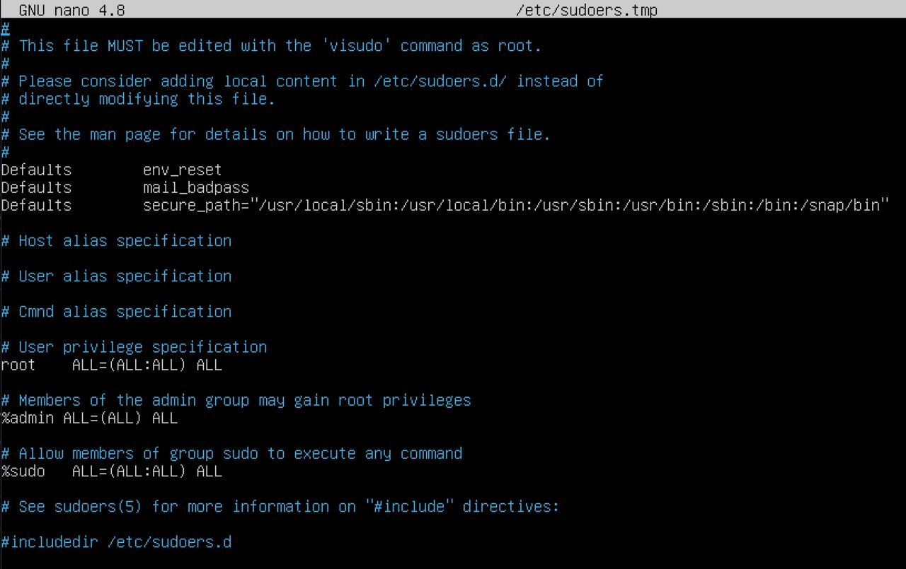
Стало:
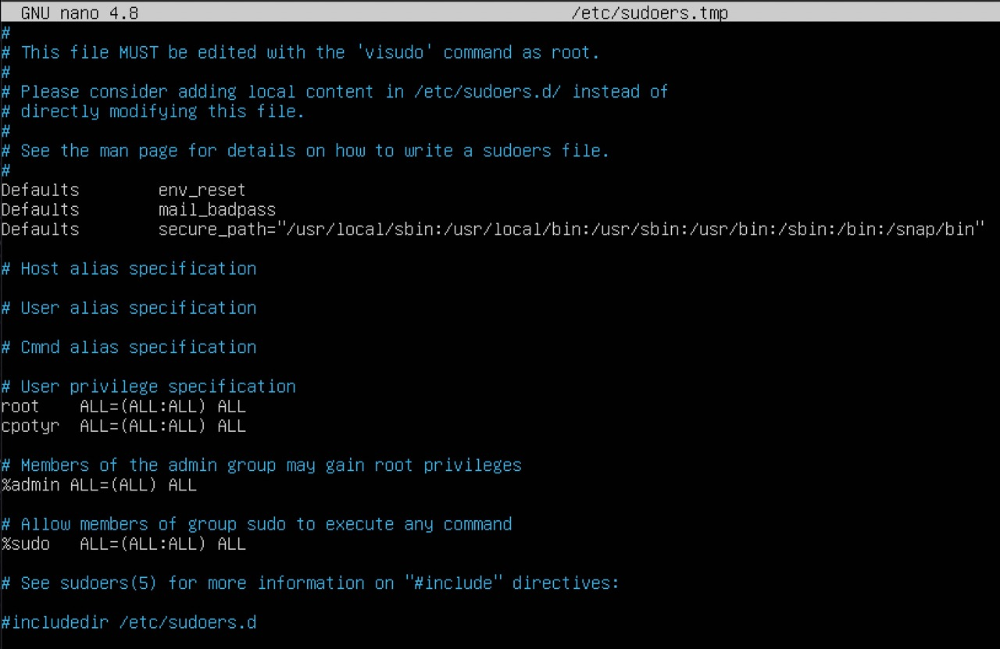

> Я добавил строчку `cpotyr ALL=(ALL:ALL) ALL`
> В секции под комментарием `# User privilege specification`
>
> И эта спецификация позволяет пользователю *cpotyr* выполнять любые команды с использованием волшебного слова `sudo`
>
> Объяснение строки `cpotyr ALL=(ALL:ALL) ALL` :
> 
> *cpotyr*: Имя пользователя, которому предоставляются привилегии.
> 
> ALL: Команды могут выполняться на любом хосте.
> 
> (ALL:ALL):
> 
> Первое ALL: Пользователь *cpotyr* может использовать `sudo` от имени любого пользователя.
> 
> Второе ALL: Пользователь *cpotyr* может использовать `sudo` от имени любой группы.
> 
> ALL: Указывает, что *cpotyr* может выполнять **любые** команды. (Только с припиской слова `sudo`, без этой приписки выполнять все команды может только **root**, у него есть **постоянные** привилегии)

> Теперь, после добавления *cpotyr* в список судоеров, попробуем от него изменить имя хоста:
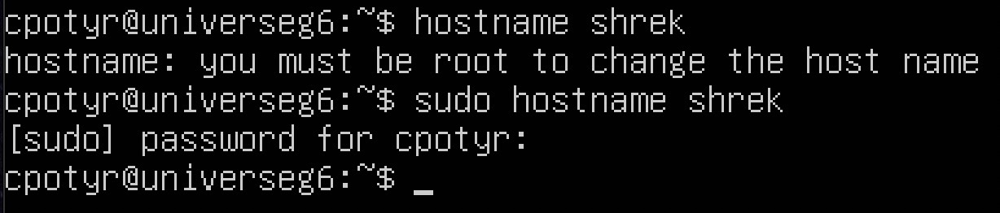
Как видим, постоянных привилегий у *cpotyr* нет, но теперь он судоер и может просить эти привелегии через `sudo`
Перезахожу в систему и смотрю изменилось ли имя хоста:
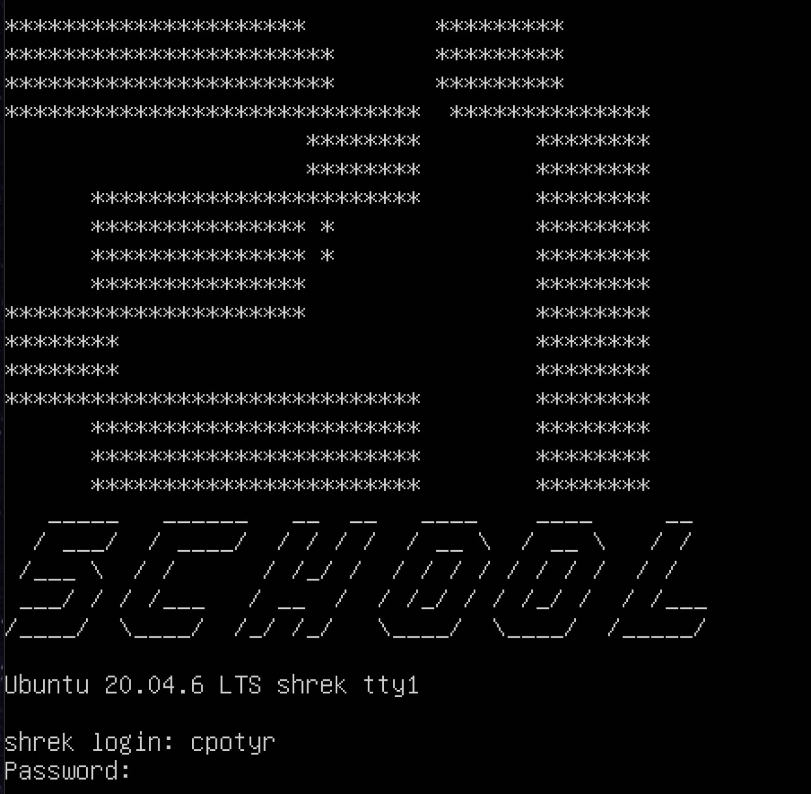

Видим что *cpotyr* смог изменить имя хоста через `sudo`

Также, добавить пользователя в список судоеров, или иначе говоря в группу *sudo* можно с помощью следующих команд:
> - [x] `sudo adduser cpotyr sudo`
> - [x] `sudo usermod -aG sudo cpotyr` (`-a` = append; `-G` = Group)

А удалить пользователя из судоеров можно вот так:
> - [x] `sudo deluser cpotyr sudo`
## Part 6. Установка и настройка службы времени
Я проверил синхронизировано ли моё время командой
> - [x] `timedatectl show`

И моё время было не синхронизировано:
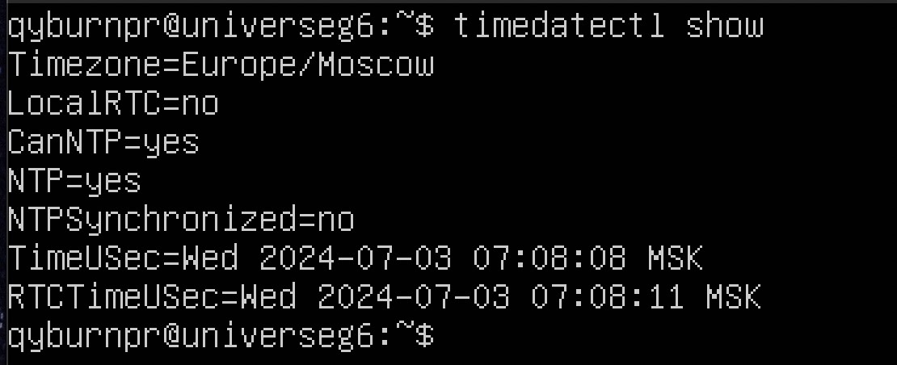
#### Но я разобрался в проблеме, и оказывается у моей виртуальной машины просто был отключен интернет-кабель. Я "воткнул" кабель:
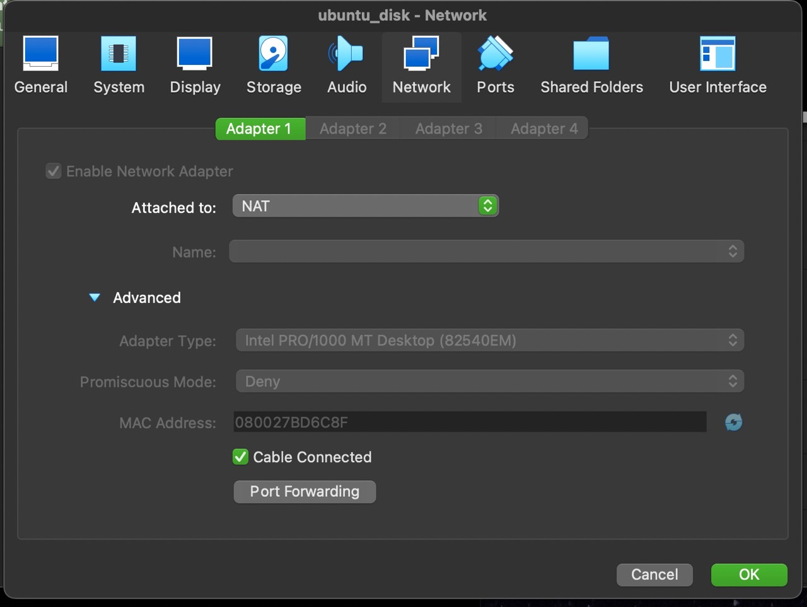
И время стало синхронизироваться, скорее всего из-за действий, которые я совершал в [Part 3](#part-3-настройка-сети-ос) :
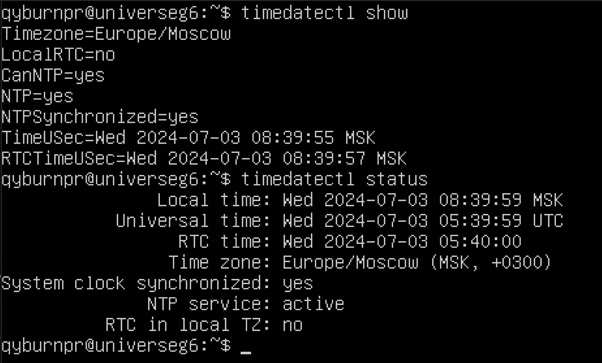
> Но вообще, сделать синхронизацию ещё можно установив утилиту **chrony**.
**chrony** — это более гибкий и мощный инструмент для синхронизации времени, который подходит для сложных и нестандартных конфигураций.
> - [x] `sudo apt install chrony` - установить
> - [x] `sudo vim /etc/chrony/chrony.conf` - открыть конфигурационный файл **chrony**
> - [x] `server pool.ntp.org iburst` - добавить строки для желаемых NTP-серверов
> - [x] `sudo systemctl enable --now chrony` - включить **chrony**
> - [x] `sudo chronyc tracking` - проверить статус **chrony**
> - [x] `sudo chronyc sources` - проверить состояние синхронизации

## Part 7. Установка и использование текстовых редакторов
##### == Задание ==
##### "Установи текстовые редакторы VIM (+ любые два по желанию NANO, MCEDIT, JOE и т.д.)"
##### "Используя каждый из трех выбранных редакторов, создай файл test_X.txt, где X -- название редактора, в котором создан файл. Напиши в нём свой никнейм, закрой файл с сохранением изменений."
##### "Используя каждый из трех выбранных редакторов, открой файл на редактирование, отредактируй файл, заменив никнейм на строку «21 School 21», закрой файл без сохранения изменений."
##### "Используя каждый из трех выбранных редакторов, отредактируй файл ещё раз (по аналогии с предыдущим пунктом), а затем освой функции поиска по содержимому файла (слово) и замены слова на любое другое."
Я выберу ***vim***, ***nano*** и ***mcedit***:

Vim и nano устанавливать не нужно, они уже есть. Итак, погнали:
> - [x] `sudo apt install mcedit`

> - [x] `touch test_vim.txt test_nano.txt test_mcedit.txt`
> 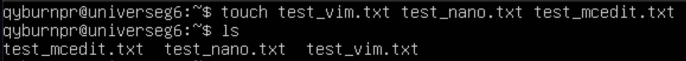

### Vim:
> - [x] `vim test_vim.txt` 
> -  Чтобы внести изменения надо нажать на кнопку <button>**`i`**</button> , это INSERT - режим вставки.
>
> - Чтобы сохранить изменения - <button>**esc**</button>-> <button>**shift**</button>+<button>**:**</button>->**`wq`**-><button>**Enter**</button>  (wq это write and quite)
> 
> 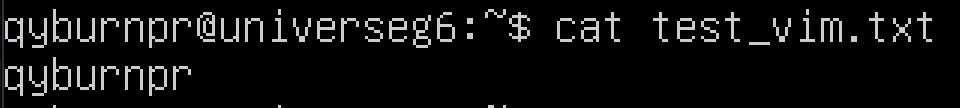

>  - Поиск слова: <button>**esc**</button> -> `/<искомое_слово>`
> 

>  - Замена слова: <button>**esc**</button> -> `:%s/<поменять_это>/<на_это>` -> <button>**Enter**</button>
> 
> 

> - Выйти без изменений: <button>**esc**</button> -> <button>**shift**</button>+<button>**:**</button> -> `q!`
> 
> 
> Проверим, что изменения не сохранились:
> 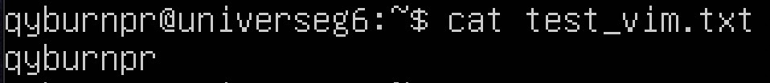
### Nano:
> - Для выхода с сохранением нужно выполнить <button>**Ctrl**</button>+<button>**o**</button>, затем <button>**Ctrl**</button>+<button>**x**</button>:
> 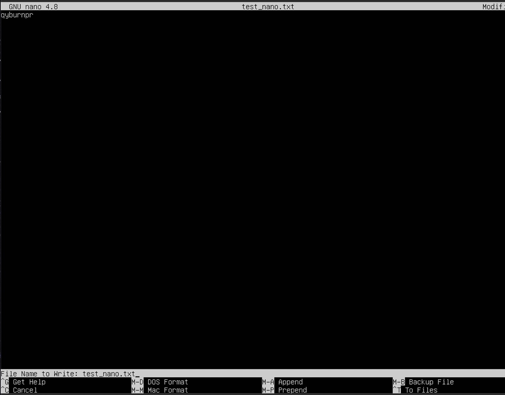

> - Для выхода без сохранения нужно нажать <button>**Ctrl**</button>+<button>**x**</button> и на вопрос редактора "Save modified buffer?" ответить "No", т.е. нажать <button>**N**</button>
> 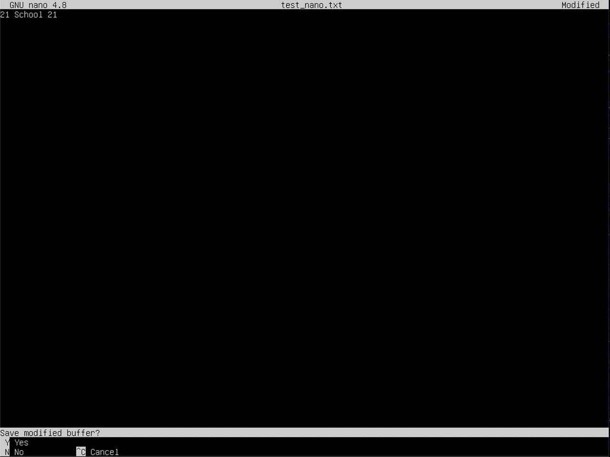
> 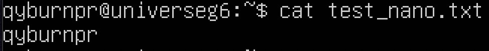

> - Поиск: <button>**Ctrl**</button>+<button>**w**</button>
> - И после нажатия <button>**Enter**</button> он установит курсор на начало слова, если такое нашлось.
> 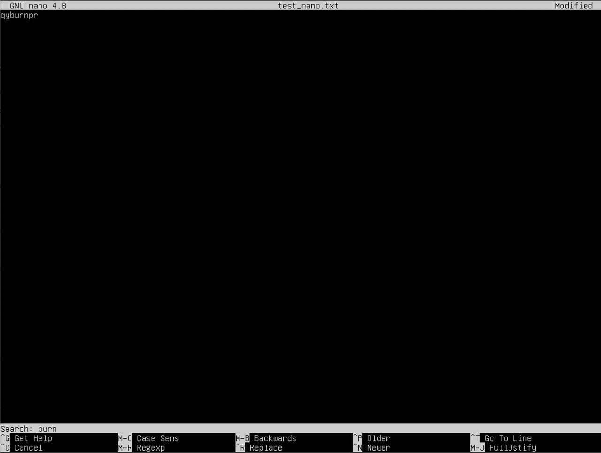

> - Замена: <button>**Ctrl**</button>+<button> \ </button> (**back**slash)
> - И ввести строчку, которая будет заменена:
> 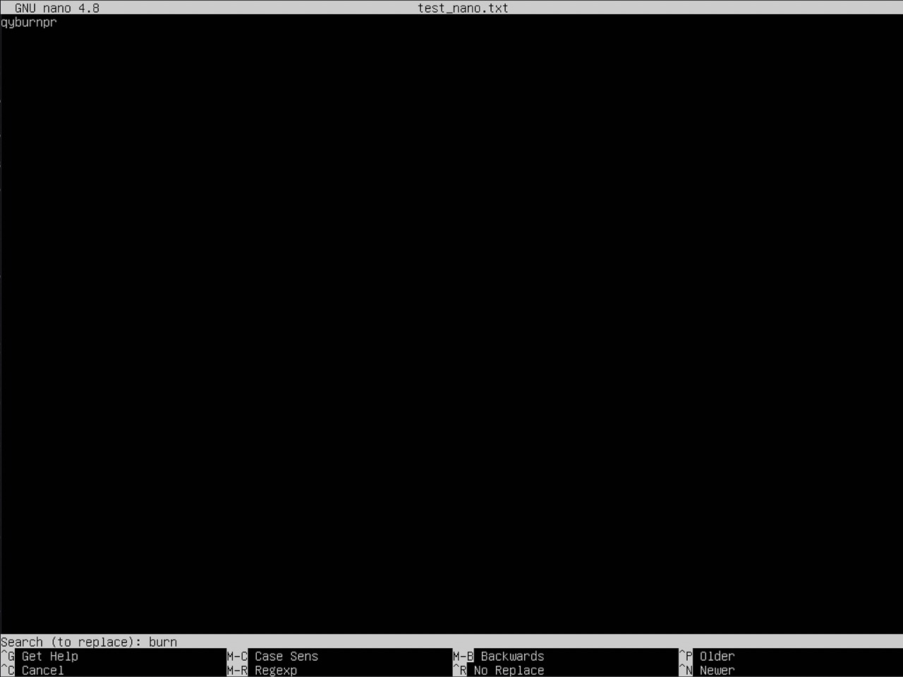
> - Ввести строчку, на что поменять:
> 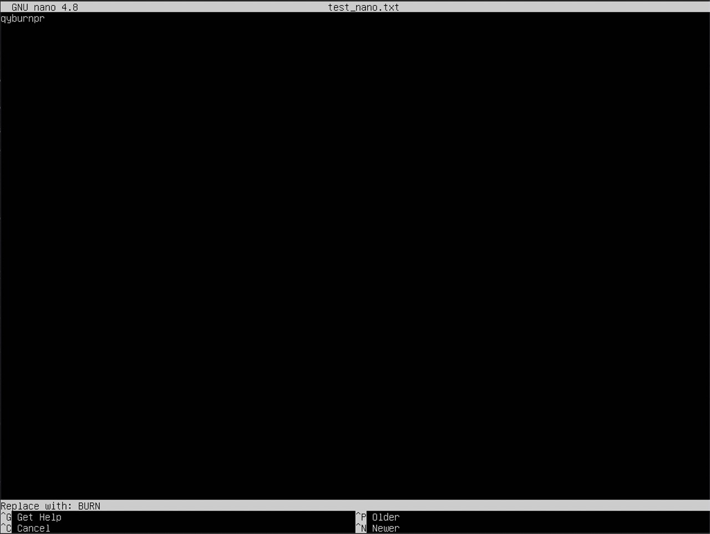
> - "Replace in this instance?" ("Заменить в этом совпадении?")
> Если нажимать <button>**y**</button>(Yes) / <button>**n**</button>(No), nano будет менять или не менять и переходить к следующему совпадению если их несколько, а если нажать <button>**a**</button>(All) заменит сразу все совпадения.
> 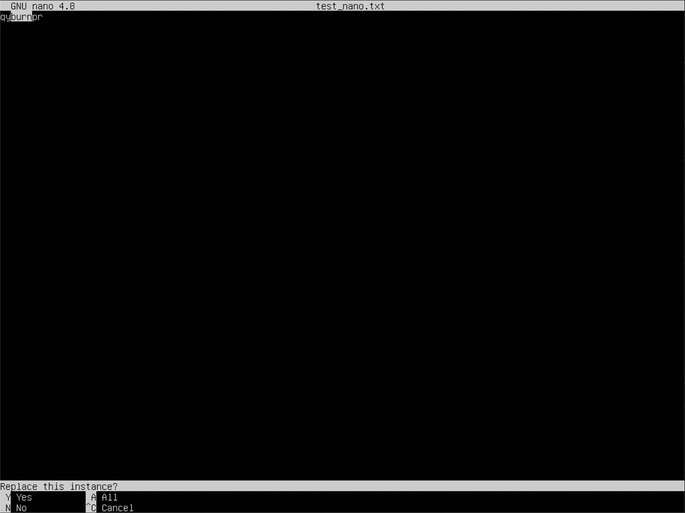
> - После nano напишет сколько совпадений он заменил
> 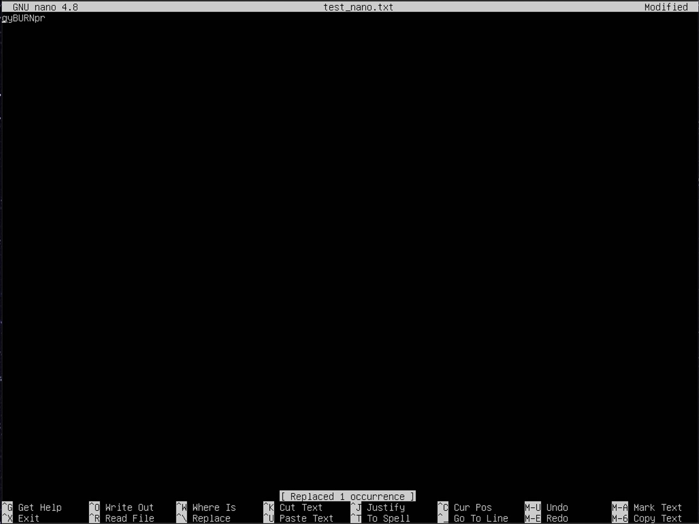

### MCEdit:
> - Для выхода С сохранением необходимо нажать <button>**F10**</button> (либо <button>**Fn**</button>+<button>**F10**</button>) и выбрать **Yes** :
> 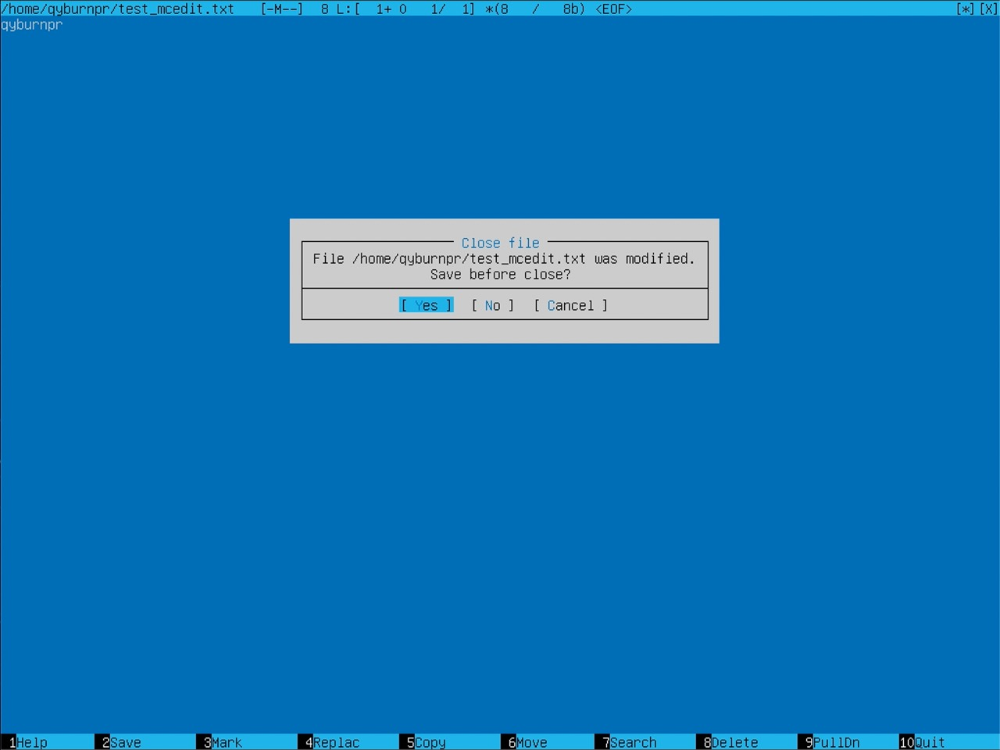

> - Для выхода БЕЗ сохранения необходимо нажать <button>**F10**</button> (либо <button>**Fn**</button>+<button>**F10**</button>) и выбрать **No** :
> 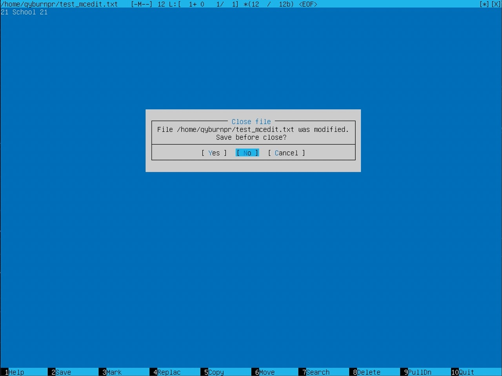
> И оно разумеется не сохранилось
> 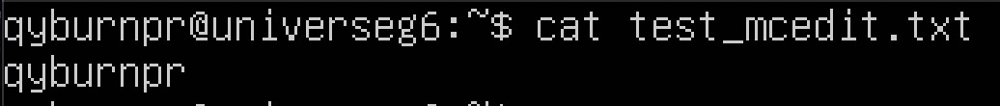

> - Поиск - <button>**F7**</button> :
> 

> - Замена - <button>**F4**</button> :
> 
> Тоже можно выбрать заменить текущее или все вхождения:
> 
> И вот оно заменилось:
> 
> 

## Part 8. Установка и базовая настройка сервиса SSHD
### Установка службы SSHd.
> - Во-первых, я заранее поставил поставил галочку перед пунктом "Install OpenSSH server" при установке системы:
> 

> - Далее установил **ssh** :
> - [x] `sudo apt install ssh`
> 
> - Далее добавил автостарт службы при загрузке системы.
> - [x] `sudo systemctl enable ssh`
> 
> - Проверил статус **ssh** :
> 
> **ssh** активен 👍

### Про SSH: 
> **SSH** значит **S**ecure **Sh**ell («безопасная оболочка»). Это такой протокол передачи данных, который позволяет производить удалённое управление операционной системой и туннелирование TCP-соединений (например, для передачи файлов). Вообще ***"протоколы"*** это правила, по которым передаются какие-либо данные от одного компьютра к другому, их очень много и они все разные.
Одним из первых протоколов был и остаётся , но он плох тем, что любой, кто перехватит трафик, передающийся по **Telnet**, легко прочитает эту информацию, например узнает все пароли, переданные по этому протоколу.
А **ssh**, в отличие **Telnet** шифрует весь трафик, включая и передаваемые пароли. Если вы не хотите чтобы злые перехватчики узнали ваши пароли или что-нибудь ещё, не используйте **Telnet** используйте **SSH** !
>
> SSH допускает выбор различных алгоритмов шифрования. SSH-клиенты и SSH-серверы доступны для большинства сетевых операционных систем.
>
> SSH позволяет безопасно передавать в незащищённой среде практически любой другой сетевой протокол. Можно не только удалённо работать на компьютере через командную оболочку, но и передавать по шифрованному каналу звуковой поток или видео (например, с веб-камеры).
### Перенастройка службы SSHd на порт 2022:
> Во-первых, сначала я добавил порт к своей виртуальной машине:
> 
> И перезагрузил машину:
> - [x] `reboot`

> - Для перенастройки службы SSHd надо открыть файл **/etc/sshd_config**
> - [x]  `sudo vim /etc/ssh/sshd_config`
> 
> По умолчанию строчка с портом будет закомментирована и порт будет задан 22, раскомменчиваю строчку и изменяю порт на 2022:
> 
##### "Используя команду ps, покажи наличие процесса sshd. Для этого к команде нужно подобрать ключи."
> - Cмотрю информацию о процессе sshd следующей командой:
> - [x] `ps -FC sshd`
> 
>  > Флаги: 
> >
> > `F` выдает подробную информацию
> >
> > `С` выдает информацию по дочерним процессам
> 
> 
Процесс есть 👍
##### "Перезагрузи систему."
> - [x] `reboot`
> 
> также службу можно перезапустить командой `sudo systemctl restart sshd.service`
##### "Вывод команды netstat -tan должен содержать tcp 0 0 0.0.0.0:2022 0.0.0.0:* LISTEN (если команды netstat нет, то ее нужно установить)"
> У меня нет netstat, следовательно устанавливаю его:
> - [x] `sudo apt install net-tools`
> 

> netstat (*net*work *stat*istics) — утилита командной строки, выводящая на дисплей состояние TCP-соединений (как входящих, так и исходящих), таблицы маршрутизации, число сетевых интерфейсов и сетевую статистику по протоколам.
> - [X] `netstat -tan`
> > Флаги: 
> >
> > `t` - показывает только TCP соединения
> >
> > `а` - показывает все активные TCP-подключения и прослушиваемые компьютером порты TCP и UDP
> >
> > `n` - показывает активные TCP-подключения с отображением адреса и номера порта в числовом формате без попыток определения имен.
>
> 
> > Что нам показывают колонки: 
> >
> > - **Proto**: используемый протокол, в данном случае **tcp**
> >
> > - **Recv-Q**: (**Rec**ie**v**ed **Q**ueue) очередь полученных данных, которые ещё не обработаны
> >
> > - **Send-Q**: (**Send** **Q**ueue) очередь данных, ожидающих отправки
> >
> > - **Local Address**: локальный адрес и порт
> > 
> > - **Foreign Address**: удалённый адрес и порт
> >
> > - **State**: Состояние соединения (например, LISTEN, ESTABLISHED, TIME_WAIT, и т.д.). Этот вывод показывает, какие TCP-порты прослушиваются на системе и какие активные TCP-соединения установлены.
> > > **Какие бывают остояния в State**:
> > > - **LISTEN**: Сервер слушает входящие соединения на указанном порту. Ожидает запросы на подключение.
*Типичный контекст: Ожидание нового соединения на сервере.*
> > > - **SYN_SENT**: Клиент отправил запрос на установление соединения (SYN) и ожидает ответа (SYN-ACK) от сервера.
*Типичный контекст: Начальная фаза установки соединения с сервером.*
> > >
> > > - **SYN_RECIEVED**: Сервер получил SYN-запрос от клиента и отправил обратно SYN-ACK, ожидая подтверждения (ACK).
*Типичный контекст: Ожидание подтверждения от клиента для завершения установки соединения.*
> > >
> > > - **ESTABLISHED**: Соединение установлено, и можно передавать данные между клиентом и сервером 👍.
*Типичный контекст: Активное соединение, обмен данными.*
> > >
> > > - **FIN_WAIT_1**: Процесс, инициировавший закрытие соединения, отправил FIN-запрос и ожидает подтверждения от другой стороны.
*Типичный контекст: Начало процедуры закрытия соединения.*
> > >
> > > - **FIN_WAIT_2**: Процесс получил подтверждение от другой стороны на FIN-запрос и ждет, пока та отправит свой FIN-запрос.
*Типичный контекст: Завершающая фаза закрытия соединения.*
> > >
> > > - **CLOSE_WAIT**: Процесс получил запрос на закрытие соединения от другой стороны и ожидает завершения своей стороны соединения.
*Типичный контекст: Ожидание завершения закрытия соединения.*
> > >
> > > - **CLOSING**: Обе стороны одновременно отправили запрос на закрытие соединения, и ждут завершения.
*Типичный контекст: Обе стороны отправили FIN, но не получили подтверждения.*
> > >
> > > - **LAST_ACK**: Процесс отправил окончательный FIN и ждет подтверждения на него.
*Типичный контекст: Завершающая стадия после отправки FIN-запроса.*
> > >
> > > - **TIME_WAIT**: Процесс ждет окончания таймера для уверенности, что последний ACK достиг другой стороны.
*Типичный контекст: Предотвращение ошибок из-за повторных пакетов в сети.*
> > >
> > > - **CLOSED**: Соединение закрыто и не используется.
*Типичный контекст: Нет активного или ожидающего соединения.*
> > >
> > > - **RESET**: Соединение было резко разорвано из-за ошибки или отказа.
*Типичный контекст: Необычное завершение соединения.*
> > >
> > > - **UNKNOWN / IDLE**: Могут появляться в специфических системах или инструментах для обозначения непонятных или бездействующих состояний.
> > >
> > > Эти состояния помогают отслеживать и управлять соединениями, диагностировать проблемы и понимать текущее состояние сетевой активности.
>
> **0.0.0.0** - это ip-адрес, который часто используется для обозначения всех IP-адресов, доступных на хосте. Это означает, что сервис, слушающий на 0.0.0.0, будет принимать входящие подключения на всех сетевых интерфейсах и на всех IP-адресах, которые настроены на этих интерфейсах. Этот адрес также называют немаршрутизируемым, и он используется в качесте адреса по умолчанию или адреса-заполнителя.
> 
> Команда `netstat` показывает статистику приема и отправки пакетов, а также информацию об ошибках приема и отправки. И если `netstat -na` - это просмотр **всех** открытых протоколов, то `netstat -tan` - это просмотр только всех открытых ТСР-протоколов.

Теперь, поскольку я установил и настроил сервис SSHD я могу подключиться к своему виртуальному серверу с терминала своей домашней системы (домашняя система - система в которой запущена моя виртуальная машина, система виртуальной машины называется гостевой).

Сделать это я могу через утилиту **ssh** (для которой это всё и настраивалось), используя проброшенный мной порт 2022.


Теперь у меня есть Линукс в терминале моей домашней системы (в моём случае в терминале мака),
и это кстати замечательно, поскольку я теперь могу копировать и вставлять любой текст в терминал моего виртуального сервера Ubuntu, выделяя текст мышкой. Можно даже подключиться к этому виртуальному серверу через Visual Studio Code и работать в ВСкоде со всей файловой системой этого виртуального сервера. То есть в ВСкоде будет и сайдбар с файлами виртуалки, и можно создавать, редактировать и удалять любые файлы, которые есть на этом виртуальном сервере через ВСкод, и можно точно также открыть в ВСкоде терминал этого виртуального сервера. Как это сделать:
Нужно установить ВСкод расширение "Remote - SSH" от Microsoft, далее тыкнуть в нижнем левом углу ВСкода на вот такую кнопку:

В верхней полосочке ВСкода выползет кнока <button>**Подключение к узлу... ____________________________ Remote-SSH**</button>

Тыкаем на неё и в окошке выйдет сообщение "*Выберите настроенный узел SSH или введите user@host*".

Пишем в это окошко **username**@localhost:**port** , где **username** - имя любого пользователя, какой есть на этом сервере, а **port** - порт, который мы пробросили, в моём случае 2022. Я например могу написать `qyburnpr@localhost:2022` или `cpotyr@localhost:2022` или даже `root@localhost:2022`. Пишем и вводим. Окошко в ВСкоде спросит пароль для введённого пользователя сервера. Вводим пароль.

 И когда оно загрузится можем ещё и открыть сбоку папку. ВСкод снова спросит пароль выбранного пользователя, вводим. Потом спросит доверять ли авторам, ну и поскольку мы доверяем сами себе - нажимаем <button>доверять</button>, и откроется сайдбар с файлами виртуального сервера.

Примерно так это всё может выглядить:

Конкретно сейчас слева я открыл домашнюю папку пользователя *qyburnpr*, но разумеется можно открыть любую другую. Ну и, я думаю, открыть удалённый сервер можно не только в ВСкоде, но и в любой другой полноценной среде разработки.
## Part 9. Установка и использование утилит top, htop
##### "Установи и запусти утилиты top и htop."
Опять же, как **top** так и **htop** на моей системе уже были установлены. Начну с **top**.
### **top** 
##### top - **T**able **O**f **P**rocesses (таблица процессов)
> Для запуска утилиты пишу команду:
>
> - [x] `top`
> 
> 
> Колонки, которые выводит программа очень похожи на ps:
>
> - **PID** - идентификатор процесса;
> - **USER** - имя пользователя, от имени которого выполняется процесс;
> - **PR** - приоритет планировщика, установленный для процесса;
> - **NI** - рекомендуемый приоритет процесса. Это значение можно менять, может не совпадать с реальным приоритетом планировщика;
> - **VIRT** - всё, что находится в памяти, используется или зарезервировано для использования;
> - **RES** - всё, что находится в оперативной памяти и относится к процессу. Расшифровывается как **Res**ident Memory Size, указывается в килобайтах;
> - **SHR** - часть памяти из **RES**, которую занимают ресурсы, доступные для использования другим процессам. Расшифровывается - **Sh**a**r**ed Memory Size.
> - **S** - состояние процесса: **D** - ожидает завершения операции, **R** - запущен, **S** - спит, **T** - остановлен, **t** - остановлен отладчиком, **Z** - зомби;
> - > Проце́сс-зо́мби, зо́мби (англ. zombie process, англ. defunct process) — дочерний процесс в Unix-системе, завершивший своё выполнение, но ещё присутствующий в списке процессов операционной системы, чтобы дать родительскому процессу считать код завершения. Процесс «умер», но не «погребён».
> - **%CPU** - процент использования ресурсов процессора;
> - **%MEM** - процент использования ресурсов оперативной памяти на основе колонки RES;
> - **TIME** - обще процессорное время, которое процесс использовал с момента запуска;
> - **COMAND** - команда, с помощью которой был запущен процесс.
> - ##### "По выводу команды top определи и напиши в отчёте:"
> 
>   - **uptime:** 1:35 (1 час 35 минут)
>   - **количество авторизованных пользователей:** 2
>   - **общую загрузку системы:** за 1 минуту - 0.00; за 5 минут - 0.00; за 15 минут - 0.00; 
>   - **общее количество процессов:** 125
>   - **загрузку cpu:** 0.0 us,  0.0 sy,  0.0 ni, 100.0 id,  0.0 wa,  0.0 hi,  0.0 si,  0.0 st
>   - **загрузку памяти:** 184.1 из 7929.5 (Мегабайт оперативной памяти)
>   - **pid процесса занимающего больше всего памяти:** 790
>
>       - - [x] <button>**shiht**</button>+<button>**m**</button>
>       - 
>       - **PID** = 790; **%MEM** = 0.4;
>   - **pid процесса, занимающего больше всего процессорного времени:** 2219
>       - - [x] <button>**shift**</button>+<button>**p**</button>
>       - 
>       - **PID** = 2219; **%CPU** = 0.7;
### **htop** 
##### Htop - "**H**isham's **top**" (Hisham - имя автора программы)
> Для запуска утилиты пишу команду:
>
> - [x] `htop`
> 
> #### Сортировка в **htop**:
> >
> > Чтобы отсортировать процессы в **htop** используется клавиша <button>**F6**</button>(SortBy) , либо можно нажать на **SortBy** мышкой и выбрать нужный критерий, или сортировать процессы сразу тыкая мышкой на нужную колонку (**PID**, **USER**, **PRI** и т.д.). Это возможно поскольку **htop** поддерживает управление курсором.
> >
> > И поскольку я настроил к этому серверу подключение по ssh я теперь могу заходить на него с терминала мака и пользоваться мышкой. Через VirtualBox я пользоваться мышкой на сервере не мог.
> > - Сортировка процессов по **PID**: 
> > 
> > - Сортировка по **PERCENT_CPU**:
> > 
> > - Сортировка по **PERCENT_MEM**: 
> > 
> > - Сортировка по **TIME**:
> > 
> >
> > **Htop** может отсортировать процессы как по возрастанию так и по убыванию, когда тыкаешь на колонку первый раз, он сортирует по возрастанию, второй раз - по убыванию.
>
> #### Фильтрация процессов:
> > Фильтрация процесса осуществляется кнопкой <button>**\\**</button>(backslash)
> >
> > Фильтрация происходит только по названию команды, запустившей процесс (то есть нужно смотреть в колонку **Command**).
> > - Фильтрация по имени "sshd":
> > - [x] надо нажать кнопку <button> **\\** </button> (backslash) и ввести желаемый набор символов
> > 
> > **htop** отфильтровал процессы найдя "sshd" в командах, запустивших эти процессы. Удобство в том, что все остальные процессы он не показывает, потому и фильтр.
>
> #### Поиск процессов:
> > Поиск процесса осуществляется кнопкой <button>**/**</button>(slash)
> >
> > Поиск также происходит только по названию команды, запустившей процесс.
> > - Поиск по имени "***syslog***":
> > - [x] надо нажать кнопку <button>**/**</button>(slash) и ввести желаемый набор символов
> > 
> > Нажатием на <button>**F3**</button> можно перейти к следующему процессу, найденному поиском по указанному набору символов, если таких процессов нашлось несколько. В стандартной цветовой теме текущий найденный процесс выделяется жёлтым цветом.(Тему, как и ещё кучу всего можно настроить нажав на <button>**F2**</button>"**Setup**")
> #### Настройки вывода:
> > Настроить **htop** можно нажав на <button>**F2**</button>"**Setup**"
> >
> > или зажав комбинацию клавиш <button>**Shift**</button>+<button>**s**</button>(setup)
> > - Добавляю в настройках вывода **hostname**, **clock** и **uptime** в правую колонку.
> > 
> > Теперь **htop** показывает справа дополнительно имя хоста, текущее время, и время работы системы:
> > 
> В **htop** очень много настроек, можно полностью настроить его на свой вкус и цвет ~~так что родная мама не узнает~~

## Part 10. Использование утилиты fdisk
##### "Запусти команду fdisk -l"
- [x] `sudo fdisk -l`
  - `-l` - `l`ist partitions (список разделов диска)
##### "В отчёте напиши название жесткого диска, его размер и количество секторов, а также размер swap."

- Название жёсткого диска: **/dev/sda** (dev - **dev**ices)

    > **/dev/sda** это имя по которому операционная система идентифицирует это устройство;
        Я уже писал что в операционной системе Linux «всё есть файл». И различные внешние устройства тоже. Поэтому, любые подключённые микрофоны, клавиатуры, флешки, и диски — это лишь файлы, которые находятся в отдельном каталоге для устройств(девайсов) /dev.
    >
    > Почему "**sda**":
    >
    > **sd**: **S**CSI **D**isk — Изначально обозначало жесткий диск с интерфейсом SCSI(Small Computer System Interface). В современном контексте это более общее обозначение для дисков, работающих через SCSI-совместимый протокол (SATA, USB, SAS).
    >
    > **a**: Первая буква алфавита, используется для обозначения первого обнаруженного или подключенного устройства. Последующие буквы указывают на дальнейшие устройства в порядке их обнаружения. Т.е. следующие диски называвлись бы **/dev/sdb**, **/dev/sdc** и т.д.

- Размер диска: 32 Gib (или 34359738368 байт)
- Количество секторов: 67 108 864
- Размер swap: 0 бит
  - [x] `free -h ` (`-h` -- human-readable)
  

Также, по первому скриншоту (в этом парте) мы видим что основная файловая система находится в разделе диска **/dev/sda1** занимая 29 Гигабайт.

## Part 11. Использование утилиты df
"**df**" -- **d**isk **f**ree

**df** - утилита в UNIX-подобных системах, показывает список всех файловых систем по именам устройств, сообщает их размер, занятое и свободное пространство и точки монтирования.
##### Запусти команду df.
- [x] `df`

- [x] `df /`

> Информация для корневого раздела (/):
> - Размер раздела: ***14 830 568***
> - Размер занятого пространства: ***3 534 932***
> - Размер свободного пространства: ***10 520 468***
> - Процент использования: ***26%***
> - Единица измерения: ***Килобайт***
##### Запусти команду df -Th.
- [x] `df -Th` ( `-T` -- добавляет столбец с типом файловой системы (например, ext4, xfs, tmpfs))

- [x] `df -Th /`

> Информация для корневого раздела (/):
> - Размер раздела: ***15***
> - Размер занятого пространства: ***3.4***
> - Размер свободного пространства: ***11***
> - Процент использования: ***26%***
> - Единица измерения: ***Гигабайт***
> - Тип файловой системы: ***ext4***

## Part 12. Использование утилиты du
"**du**" -- **d**isk **u**sage

**du** - стандартная Unix-программа для оценки занимаемого файлового пространства.
##### "Запусти команду du"
- [x] `sudo du -h ` (`-h` -- **h**uman-readable (в килобайтах, гигабайтах и т.д.))

##### "Выведи размер папок /home, /var, /var/log (в байтах, в человекочитаемом виде)"
- [x] `sudo du -s /home` - в байтах
- [x] `sudo du -s /var`
- [x] `sudo du -s /var/log`

- [x] `sudo du -sh /home` - в человекочитаемом виде
- [x] `sudo du -sh /var`
- [x] `sudo du -sh /var/log`

- `-s` - (--**s**ummarize) отображает только общий размер для каждого аргумента (для **du** аргументы - директории или файлы)
##### "Выведи размер всего содержимого в /var/log (не общее, а каждого вложенного элемента, используя *)"
- [x] `sudo du /var/log/*` - в байтах

- [x] `sudo du -h /var/log/*` - в человекочитаемом виде


## Part 13. Установка и использование утилиты ncdu
Ncdu (**NC**urses **D**isk **U**sage) является инструментом командной строки для просмотра и анализа использования дискового пространства на Linux. Он может показать древовидные каталоги и дать отчет о свободном пространстве на HDD, используемого в отдельных каталогах. Таким образом, очень легко отследить сколько занимает места файлы / каталоги.
##### "Установи утилиту ncdu"
- [x] `sudo apt install ncdu`

##### "Выведи размер папок /home, /var, /var/log"
- [x] `ncdu /home`

- [x] `ncdu /var`

- [x] `ncdu /var/log`

Размеры совпадают с размерами полученными в Part 12.
## Part 14. Работа с системными журналами
(факт от англичан: "**log**" это "журнал")
##### "Открой для просмотра:"
##### 1. /var/log/dmesg:
dmesg - **d**iagnostic **mes**sa**g**e (диагностическое сообщение)

Файл **/var/log/dmesg** в Linux содержит системные сообщения, связанные с ядром. Эти сообщения включают информацию о процессе загрузки системы, обнаружении оборудования, инициализации драйверов, а также о других событиях, связанных с ядром. 
> - [x] `tail -n 52 /var/log/dmesg`
> - `tail -n` - команда, позволяющая вывести последние n строчек текстового файла.
> 
> 
> В этот лог записывается информация о процессах последней загрузки системы.
> 
> Информация о времени загрузки системы указана в квадратных скобках **[ ]** 
>
> В последний раз система загрузилась за 8.39 секунд

##### 2. /var/log/syslog:
syslog - **sys**tem **log** (системный журнал)

Файл **/var/log/syslog** в Linux содержит системные логи, которые включают важные сообщения от ядра Linux о работе системы, служб и различных программ. Это общее хранилище для логов, которые не имеют собственных специализированных лог-файлов.

Формат сообщений в **/var/log/syslog**:

Каждое сообщение в **/var/log/syslog** обычно состоит из:

- **Дата и время:** Указывает время записи.
- **Имя хоста:** Имя компьютера, на котором был создан лог.
- **Процесс:** Имя процесса и его идентификатор (PID), создавший запись.
- **Сообщение:** Текстовое сообщение, описывающее событие.
> - [x] `tail -n 25 /var/log/syslog`
> 
##### 3. /var/log/auth.log
auth.log - **auth**entication **log** (журнал аутентификаций)

В файл **/var/log/auth.log** записывается информация об авторизации пользователей, включая удачные и неудачные попытки входа в систему, а также задействованные механизмы аутентификации.

Файл **/var/log/auth.log** предоставляет информацию о **методах** аутентификации и действиях пользователей, таких как:

- **SSH входы:** Успешные и неудачные попытки, а также источники подключений.
- **Локальные входы:** Входы через терминал или консоль.
- **Использование su:** Переключение пользователей в рамках текущей сессии.
- **Задания cron:** Запуск автоматических задач от имени пользователей.
> - [x] `tail -n 23 /var/log/auth.log`
> 
> Методы показаны на четвёртой колонке лога (sshd, su, system-logind, agetty, login, systemd, CRON)
> ##### "Напиши в отчёте время последней успешной авторизации, имя пользователя и метод входа в систему":
> - **Время последней успешной авторизации:** 6 Июля 11:17:01
> - **Имя пользователя:** root
> - **Метод входа в систему:** CRON[1313]: pam_unix(cron:session)

##### "Перезапусти службу SSHd":
> - [x] `sudo systemctl restart sshd`
> ##### "Вставь в отчёт скрин с сообщением о рестарте службы (искать в логах)."
> - [x] `tail -n 23 /var/log/auth.log | grep -n "restart sshd`
> 
> Видим что в лог **/var/log/auth.log** добавились строчки с сообщениями о рестарте службы **sshd**.

## Part 15. Использование планировщика заданий CRON
***CRON*** — классический [демон](#демонами-daemon-в-unix-подобных-системах-называют-компьютерные-программы-запускаемые-самой-системой-и-работающие-в-фоновом-режиме-без-прямого-взаимодействия-с-пользователем) (компьютерная программа в системах класса UNIX), использующийся для периодического выполнения заданий в определённое время. Регулярные действия описываются инструкциями, помещенными в файлы **crontab** и в специальные каталоги. ***CRON*** позволяет автоматизировать выполнение повторяющихся задач по расписанию.

##### Демонами (daemon) в UNIX-подобных системах называют компьютерные программы запускаемые самой системой и работающие в фоновом режиме без прямого взаимодействия с пользователем.

Название ***cron*** образовано от греческого слова χρόνος (хрόнос) — время (по-английски — chronos), разработчик - Кен Томпсон (автор системы UNIX).
##### "Используя планировщик заданий, запусти команду uptime через каждые 2 минуты."
Чтобы автоматизировать через ***CRON*** какие-либо действия нужно редактировать **crontab**-файл. Каждая строка в файле **crontab** состоит из шести полей:


Соответственно чтобы настроить запуск какой-то команды через каждые 2 минуты нужно менять самое первое поле.
> Чтобы настроить **crontab** надо написать команду:
> - [x] `crontab -e ` (`-e ` - **e**dit(редактировать))
> - команда `crontab -e` открывает временный файл, в котором уже представлены все текущие задания cron (можно добавить новые) для текущего пользователя.
> 
> **crontab** предлагает выбрать редактор и подсказывает что **nano** - самый лёгкий :D. Окей, выберу его.
> 
> Открылся вот такой файл, с полезной информацией о себе в виде закомментированных строчек, и на последней строчке как раз представлен формат написания конфигураций:
>
> **m h dom mon dow command**
>
> **m**inute **h**our **d**ay_**o**f_**m**onth **mon**th **d**ay_**o**f_**w**eek **command**
> 
> Соответственно пишу под этой строчкой
> - [x] **`*/2 * * * * uptime`**
>
> Что и будет значить "запускай команду `uptime` через каждые 2 минуты"
>
> Сохраняю и закрываю. Вышла следующая строчка:
> 
> 
> 
> что значит что **crontab**-файл загрузился и вступил в силу.
> 
> Теперь мне нужно подождать несколько минут и потом глянуть лог **/var/log/syslog** и посмотреть вызывалась ли моя команда каждые 2 минуты.
> 
> Видим, что команда  `uptime` вызывалась в **15:00**, **15:02**, **15:04**, **15:06**, **15:08**. Значит **crontab** настроен правильно и ***CRON*** работает 👍.
##### "Выведи на экран список текущих заданий для CRON"
> - [x] `crontab -l ` (`-l ` - list(список))
> 
##### "Удали все задания из планировщика заданий."
> - [x] `crontab -r` (`-r ` - **r**emove(удалить))
> 
> 
> 
> Видим что после удаления списка заданий больше нет 👍.
___
Это была базовая работа с серверной версией операционной системы Ubuntu GNU/Linux. **Tux** доволен! 🐧
